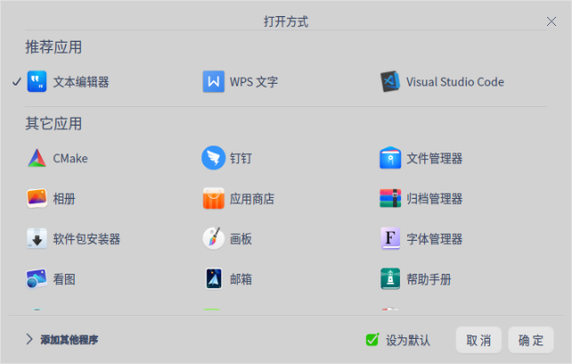
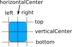
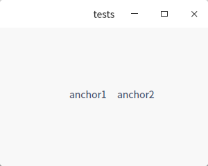
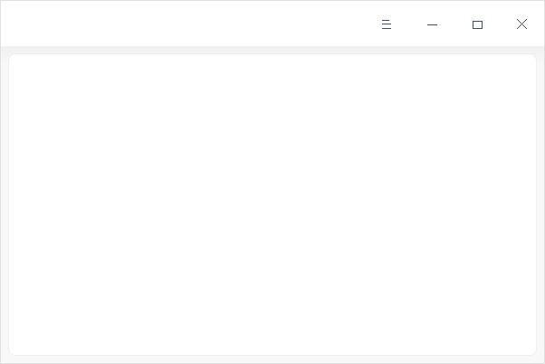
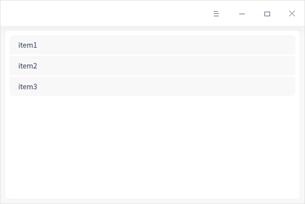
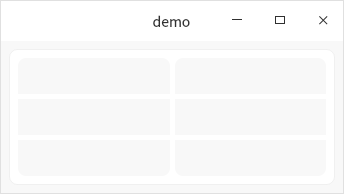
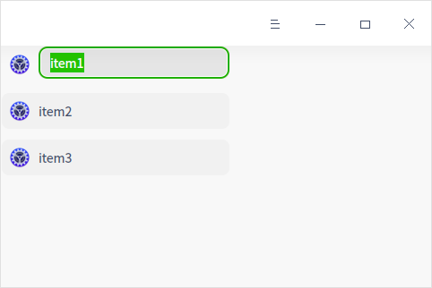
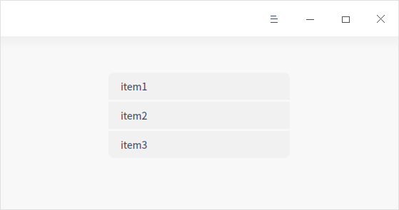

## 布局

​除了 Qt 自带的一些布局 Layout 类，还可以使用 DTK 自己实现或重写过的一些类来更好的实现界面的布局。

### DFlowLayout

​DFlowLayout 用于创建一个新的流布局管理器，具有指定的对齐方式以及指定的水平和垂直间隙，用于图形化界面设计，示例代码如下。

```c++
#include <DFlowLayout.h>
#include <DFloatingButton>

    DMainWindow w;
    DFlowLayout layout;
    QWidget *widget = new QWidget(&w);
    widget->setLayout(&layout);

for (int i = 0; i< 3000; ++i) {
    DFloatingButton *button = new FloatingButton(widget);
    layout.insertWidget(i, button);

}
```

该布局提供了一种平铺的布局方式，可以适应窗口的缩放，典型的例子如右键菜单中的选择打开方式，然后选择默认程序的界面。可以做出如下图所示这样的效果：



### DAnchors

锚定布局是基于锚线来确定控件之间的布局关系的一种布局管理方式。锚线有六种：左、水平居中、右、顶端、垂直居中、底端，如下图所示：



如下代码所示，是使用锚定布局，围绕水平居中  horizontalCenter  和 垂直居中 verticalCenter 将两个标签 label 控件 放置在 widget 窗体中间的位置并给两个 label 控件间设置一定的间隔，具体代码如下：

```c++
#include <QLabel>
#include <DAnchors>

QWidget *widget = new QWidget;
QLabel *lb1 = new QLabel("anchor1", widget);
QLabel *lb2 = new QLabel("anchor2", widget);
DAnchors<QLabel> anchor1(lb1);
DAnchors<QLabel> anchor2(lb2);
anchor2.setLeft(anchor1.right());
anchor2.moveHorizontalCenter(widget->width()/2);
anchor2.moveVerticalCenter(widget->height()/2);
anchor1.moveHorizontalCenter(widget->width()/2);
anchor1.moveVerticalCenter(widget->height()/2);
anchor2.setLeftMargin(15);
```

效果如下图所示：

​	

注意，锚定布局同时在多个控件中使用，控件之间只需要满足以下条件：

控件之间为兄弟关系，或被锚定控件为父控件。锚定系统允许设置“锚线”之间的间距，和“锚线”一一对应，每个控件都有一组 4 个 空白 margin ：leftMargin , rightMargin , topMargin 和  bottomMargin 以及两个偏离 offset ：horizontalCenterOffset 和  verticalCenterOffset 。

### DFrame

DFrame 控件又称为容器控件，能为窗体上的控件进行分组。(见下图所示) 使用容器控件可以将一个窗体中的各种功能进一步进行分类。

```c++
 #include <DFrame>
 #include <DWidget>

  DMainWindow w;
  w.resize(600, 400);
  Dtk::Widget::moveToCenter(&w);
  DWidget *widget = new DWidget;
  w.setCentralWidget(widget);
  QVBoxLayout *layout = new QVBoxLayout(widget);
  DFrame *frame = new DFrame(widget);
  QHBoxLayout *frameLayout = new QHBoxLayout(frame);
  frame->resize(widget->size());
  layout->addWidget(frame);
  w.show();
```

​DFrame 提供了一个圆角的背景框，使得界面的布局更加简洁、美观。通常需要配合各种 Layout 一起使用，以适应页面大小。

​使用 frameLayout->addWidget (函数) 可以将想要放置的控件添加进去即可。



​比如在容器 DFrame 中添加一个 DlistView 列表控件，如下图所示：



​示例代码如下：

```c++
  #include <DFrame>
  #include <DWidget>
  #include <DListView>

  // 创建 widget
  DMainWindow w;
  w.resize(600, 400);
  w.show();
  Dtk::Widget::moveToCenter(&w);
  DWidget *widget = new DWidget;
  w.setCentralWidget(widget);

  // 添加 DFrame 与布局管理
  QVBoxLayout *layout = new QVBoxLayout(widget);
  DFrame *frame = new DFrame(widget);
  QHBoxLayout *frameLayout = new QHBoxLayout(frame);
  layout->addWidget(frame);

  // 添加 listview
  DListView *listView = new DListView(/*widget*/);
  QStandardItemModel *itemModel = new QStandardItemModel(widget);
  listView->setModel(itemModel);
  listView->setEditTriggers(QAbstractItemView::NoEditTriggers);
  listView->setBackgroundType(DStyledItemDelegate::BackgroundType::ClipCornerBackground);
  listView->setSelectionMode(QAbstractItemView::NoSelection);
  listView->setHorizontalScrollBarPolicy(Qt::ScrollBarAlwaysOff);
  listView->setVerticalScrollBarPolicy(Qt::ScrollBarAlwaysOff);
  listView->setSpacing(1);

  DStandardItem *item1 = new DStandardItem("item1");
  DStandardItem *item2 = new DStandardItem("item2");
  DStandardItem *item3 = new DStandardItem("item3");
  item1->setCheckable(true);
  item2->setCheckable(true);
  item3->setCheckable(true);
  itemModel->appendRow(item1);
  itemModel->appendRow(item2);
  itemModel->appendRow(item3);
  frameLayout->addWidget(listView);
```

### DBackgroundGroup

DBackgroundGroup 组件用于设置所有的背景属性，示例代码如下：

```c++
 #include <DFrame>
  #include <DWidget>
  #include <DBackgroundGroup>

  QMainWindow w;
  Dtk::Widget::moveToCenter(&w);
  DWidget *widget = new DWidget;
  w.setCentralWidget(widget);

  // 添加 DFrame
  QVBoxLayout *layout = new QVBoxLayout(widget);
  DFrame *frame = new DFrame(widget);
  QHBoxLayout *frameLayout = new QHBoxLayout(frame);
  layout->addWidget(frame);

  // 添加第一组 DBackgroundGroup，由 3 个 QFrame 组成
  QVBoxLayout *vlayout1 = new QVBoxLayout;
  DBackgroundGroup *group1 = new DBackgroundGroup(vlayout1,&w);
  frameLayout->addWidget(group1);
  vlayout1->addWidget(new QFrame);
  vlayout1->addWidget(new QFrame);
  vlayout1->addWidget(new QFrame);
  group1->setUseWidgetBackground(false);

  // 添加第二组 DBackgroundGroup，由 3 个 QFrame 组成
  QVBoxLayout *vlayout2 = new QVBoxLayout;
  DBackgroundGroup *group2 = new DBackgroundGroup(vlayout2,&w);
  frameLayout->addWidget(group2);
  vlayout2->addWidget(new QFrame);
  vlayout2->addWidget(new QFrame);
  vlayout2->addWidget(new QFrame);
  group2->setUseWidgetBackground(false);
```

运行效果如下图所示。DBackgroundGroup 比较像 DListView 的 ClipCornerBackground 模式，但是更加灵活，可以很方便的在里面添加一些 widget 之类的组件，在控制中心、打印预览的组件中大量用到。



### DListView

DListView 允许用户通过上下滑动来将屏幕外的数据滚动到屏幕内,同时屏幕内原有的数据滚动出屏幕,从而显示更多的数据内。下面首先给出了示例代码。

```c++
  #include <DWidget>
  #include<DListView>
  DMainWindow w;
  Dtk::Widget::moveToCenter(&w);
  DWidget *widget = new DWidget;
  w.setCentralWidget(widget);
  DListView *listView = new DListView(widget);
  QStandardItemModel *itemModel = new QStandardItemModel(widget);
  listView->setModel(itemModel);
  DStandardItem *item1 = new DStandardItem("item1");
  DStandardItem *item2 = new DStandardItem("item2");
  DStandardItem *item3 = new DStandardItem("item3");
  item1->setCheckable(false);
  item2->setCheckable(false);
  item3->setCheckable(false);
  itemModel->appendRow(item1);
  itemModel->appendRow(item2);
  itemModel->appendRow(item3);
  item1->setIcon(QIcon::fromTheme("preferences-system"));
  item2->setIcon(QIcon::fromTheme("preferences-system"));
  item3->setIcon(QIcon::fromTheme("preferences-system"));
```

DListView 经过了重绘，默认就是一些圆角的 listview ，可以给它设置图标，也可以编辑里面的文本，运行效果如下图所示：



在一些简单的应用场景中，也可将它作为一些列表中的圆角的背景，即简洁又美观：

```c++
  #include <DWidget>
  #include <DListView>
  DWidget *widget = new DWidget;
  DListView *listView = new DListView(widget);
  QStandardItemModel *itemModel = new QStandardItemModel(widget);
  listView->setModel(itemModel);
  listView->setEditTriggers(QAbstractItemView::NoEditTriggers);
  listView->setBackgroundType(DStyledItemDelegate::BackgroundType::ClipCornerBackground);
  listView->setSelectionMode(QAbstractItemView::NoSelection);
  listView->setHorizontalScrollBarPolicy(Qt::ScrollBarAlwaysOff);
  listView->setVerticalScrollBarPolicy(Qt::ScrollBarAlwaysOff);
  listView->setSpacing(1);
  DStandardItem *item1 = new DStandardItem("item1");
  DStandardItem *item2 = new DStandardItem("item2");
  DStandardItem *item3 = new DStandardItem("item3");
  item1->setCheckable(false);
  item2->setCheckable(false);
  item3->setCheckable(false);
  itemModel->appendRow(item1);
  itemModel->appendRow(item2);
  itemModel->appendRow(item3);
```

以上是使用 DListView 创建一个边框四角为圆角的列表，并禁用了滚动条，如图下图所示。这是控制中心里面一些列表的最常见的用法。


