##  DMainWindow 简介

​		DTK DMainWindow 继承自  QMainWindow ，虽然两者是继承关系，但是由于两者在表现上差异较大，因此在使用上面也有些不同。

​		DTK 有  Dark 和 Light 两套主题，可以在进入控制中心，选择个性化，选择通用，选择主题，然后设置。 DMainWindow 的主题默认是跟随系统的。如果要想让应用记住自己的主题，不跟随系统设置，请看下面 “记住应用主题” 这一段代码。

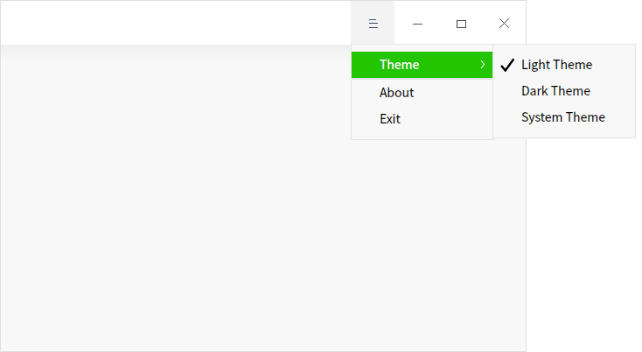

DMainWindow 还提供了一个“关于”对话框：

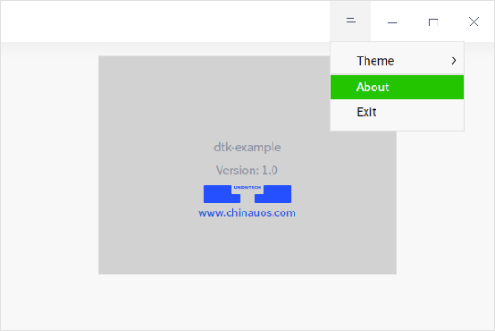

​		就像上面的代码示例中，这两行就是对关于对话框的设置：

```C++
a->setApplicationName("DTK-example");

a->setApplicationVersion("1.0");
```

​		关于对话框提供了一个系统级的标准的应用程序信息展示页面，更多的用法见“默认 about dialog ”。也可以自己定制更多内容，比如更改默认显示的图片等，参考 “ 定制关于对话框 ”。还可以在菜单中添加“设置”菜单。

### 记住应用主题
​		DApplicationSettings 类可以让系统记住当前应用主题的设置，在程序关闭后下次打开的时候依然保持之前设置的主题。具体代码和设置效果如下图所示：

```C++
#include <DApplicationSettings>

DApplicationSettings as;
```

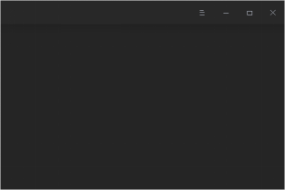

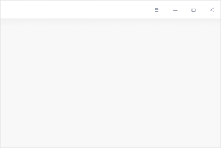

### 设置单实例

​		默认会设置为用户级别的单实例，一个用户只能打开一个应用，需要传入一个唯一字符串作为键值。

​		如果应用窗口处于最小化或隐藏状态， setAutoActivateWindows () 函数会使应用在其它进程启动的时候自动弹出窗口到最顶层。

```c++
#include <DGuiApplicationHelper>

DApplication *a = DApplication::globalApplication(argc, argv);

a->setAutoActivateWindows(true);

if (!DGuiApplicationHelper::setSingleInstance("DTK-example")) {

  qInfo() << "another instance is running!";

  return -1;

}
```

### 默认关于对话框

```c++
#include <DApplication>

DApplication *a = DApplication::globalApplication(argc, argv);

// 设置组织名称

a->setOrganizationName("Uniontech");

// 设置应用名称

a->setApplicationName("DTK-demo");

// 设置应用版本号

a->setApplicationVersion("1.0");

// 设置应用图标

a->setProductIcon(QIcon(":/images/logo.svg"));

// 设置应用产品名称

a->setProductName("DTK Widgets Example");

// 设置应用描述信息

a->setApplicationHomePage("https://bbs.chinauos.com");


a->setApplicationDescription("DTK widgets example is an demo application to demonstrate how DTK works.");

// 不显示鸣谢链接

a->setApplicationAcknowledgementVisible(false);

// 设置程序授权

a->setApplicationLicense("GPLv3");
```

​		DApplication 可以设置一个默认的关于对话框 aboutdialog ，可以通过以上接口增加或修改一些默认的信息，如下图所示。

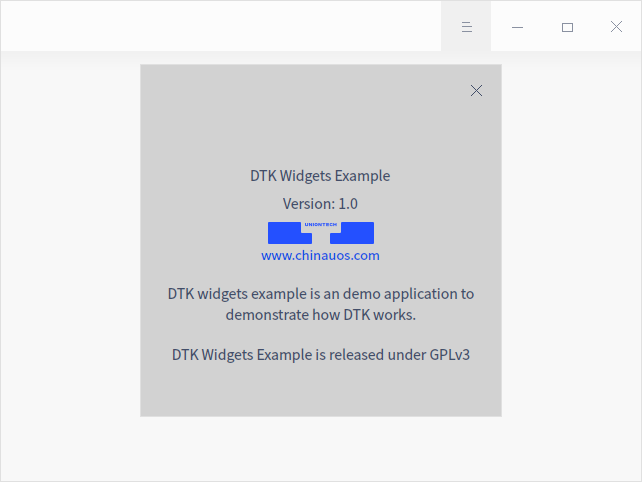

### 定制关于对话框 

​		除默认对话框之外，还可以定制关于对话框。

```c++
#include <DAboutDialog>

#include <DApplication>

DApplication *a = DApplication::globalApplication(argc, argv);

DAboutDialog aboutDialog;

aboutDialog.setVersion("1.0");

a->setAboutDialog(&aboutDialog);
```

​		除了设置版本号 setVersion() 以外，还有这些接口可供调用，用来设置关于对话框 about dialog 的各种信息：

```c++
void setWindowTitle(const QString &windowTitle);

void setProductIcon(const QIcon &icon);

void setProductName(const QString &productName);

void setDescription(const QString &description);

void setCompanyLogo(const QPixmap &companyLogo);

void setWebsiteName(const QString &websiteName);

void setWebsiteLink(const QString &websiteLink);

void setAcknowledgementLink(const QString &acknowledgementLink);

void setAcknowledgementVisible(bool visible);

void setLicense(const QString &license);
```

​		用法如下，这里为了方便，使用了一些内置的图标作为演示，具体效果如下图所示。

```c++

#include <DMainWindow>

#include <DAboutDialog>

#include <DApplication>

DMainWindow w;


Dtk::Widget::moveToCenter(&w);

DAboutDialog aboutDialog;

DApplication *a = DApplication::globalApplication(argc, argv);

a->setAboutDialog(&aboutDialog);

// 设置页面标题

aboutDialog.setWindowTitle("About Application");

// 设置应用版本号

aboutDialog.setVersion("1.0");

// 设置应用名称

aboutDialog.setProductName("DTKDemo");

// 设置应用图标

aboutDialog.setProductIcon(w.style()->standardIcon(QStyle::SP_MessageBoxQuestion));

// 设置网址名称

aboutDialog.setWebsiteName("UOS社区");

// 设置网址链接

aboutDialog.setWebsiteLink("https://bbs.chinauos.com");

// 不显示鸣谢信息

aboutDialog.setAcknowledgementVisible(false);

// 设置描述信息

aboutDialog.setDescription("DTK component usage demo.");

// 设置公司 logo

aboutDialog.setCompanyLogo(w.style()->standardIcon(QStyle::SP_ComputerIcon).pixmap(32, 32));

// 设置页面左上角图标

aboutDialog.setIcon(w.style()->standardIcon(QStyle::SP_MessageBoxQuestion));

// 设置协议信息

aboutDialog.setLicense("GPLv3");
```

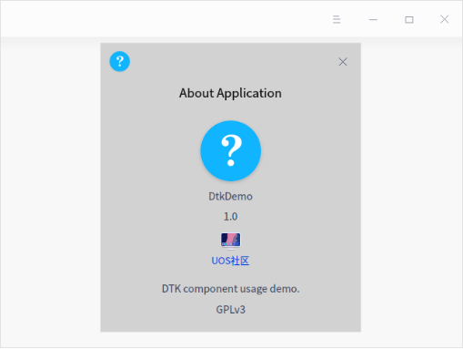

### 窗口特效

​		在较为大型复杂，功能较多的应用程序中，通常继承 QMainWindow 类来进行开发。该主窗口为搭建应用用户界面提供了非常好的框架，下面的代码给出一个简单的开发效果。

```c++
#include <DMainWindow>

#include <DPlatformWindowHandle>

QMainWindow w;

w.resize(600, 400);

DPlatformWindowHandle handle(&w, &w);

handle.setShadowColor(Qt::green);

handle.setBorderColor(Qt::red);

DTitlebar *tb = new DTitlebar(&w);

w.setMenuWidget(tb);

w.show();
```

​		上面的代码就是将一个 QMainWindow 加上绿色的阴影和红色的边框，以及标题栏，使其变成和 DMainWindow 相同的界面。

​		实际上这就是 DMainWindow 和 QMainWindow 的区别所在，DMainWindow 就是在内部调用 DplatformWindowHandle  的接口对 QMainWindow 类进行了处理。它和下面这段代码是一样的效果：

```c++
#include <DMainWindow>

DMainWindow w;

w.resize(600, 400);

w.setShadowColor(Qt::green);

w.setBorderColor(Qt::red);

w.show();
```

​		如下图  1 所示是没有设置 DTitlebar 的 QMainWindow，使用 DplatformWindowHandle 设置了边框、阴影颜色；如下图 2 所示是设置了 DTitlebar 和边框、阴影颜色的 QMainWindow ，它和  DMainWindow 几乎看不出来区别。

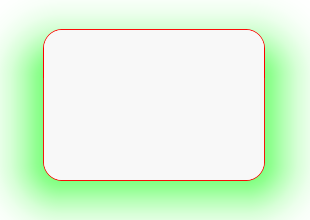

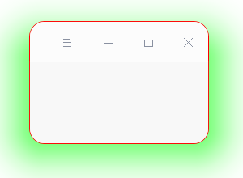

DTitlebar 主要还有这些接口可供调用，以实现各种窗口特效，具体如下：

```c++
DTitlebar *titlebar() const;

bool isDXcbWindow() const;

int windowRadius() const;

int borderWidth() const;

QColor borderColor() const;

int shadowRadius() const;

QPoint shadowOffset() const;

QColor shadowColor() const;

QPainterPath clipPath() const;

QRegion frameMask() const;

QMargins frameMargins() const;

bool translucentBackground() const;

bool enableSystemResize() const;

bool enableSystemMove() const;

bool enableBlurWindow() const;

bool autoInputMaskByClipPath() const;

bool titlebarShadowIsEnabled() const;
```

###  模糊窗口

​		DBlurEffectWidget 类继承于 QWidget 和 DObject，widget 经过高斯模糊处理，提供一种半透明的效果，透明度可调节，dde-dock 、dde-launcher 中都有使用该组件。setMode() 设置为高斯模糊的效果，setBlendMode() 可以和窗口和背景色间的颜色混合模式，setMaskAlpha() 可以设置模糊窗口的透明度，具体示例代码如下：

```c++
#include  <DPlatformWindowHandle>

#include  <DBlurEffectWidget>

DBlurEffectWidget *widget =  new DBlurEffectWidget;

widget->setMode(DBlurEffectWidget::GaussianBlur);

widget->setBlendMode(DBlurEffectWidget::InWidgetBlend);

widget->setMaskAlpha(0);
```

效果如下图所示：

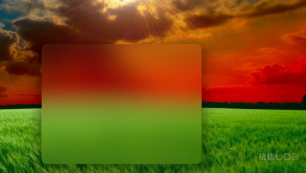

​		注意：该功能需要在控制中心开启窗口特效才有效。另外，也可以设定模糊窗口的形状、范围，具体示例代码如下：

```c++
#include  <DPlatformWindowHandle>

// 创建模糊窗口 1

DBlurEffectWidget *blurWidget1 = new DBlurEffectWidget;

blurWidget1->setFixedSize(140, 140);

blurWidget1->setBlendMode(DBlurEffectWidget::InWindowBlend);

// 设置圆角大小

blurWidget1->setRadius(30);

blurWidget1->show();

// 创建模糊窗口 2

DBlurEffectWidget *blurWidget2 = new DBlurEffectWidget;

// DBlurEffectWidget窗口背景混合模式

blurWidget2->setFixedSize(140, 140);

blurWidget2->setBlendMode(DBlurEffectWidget::BehindWindowBlend);

// 设置遮罩层颜色为暗色

blurWidget2->setMaskColor(DBlurEffectWidget::DarkColor);

// 设置控件X和Y方向的圆角半径

blurWidget2->setBlurRectXRadius(70);

blurWidget2->setBlurRectYRadius(70);

blurWidget2->setMaskAlpha(1);

blurWidget2->show();
```

​		效果如下图所示： 

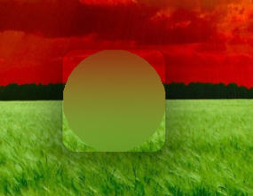

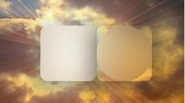

### 获取调色板与主题

​		通过调色板管理机制为每个窗体应用程序分配的调色板，选择主题，下面是示例代码。

```c++
#include <DApplicationHelper>

DMainWindow w;

const DPalette &dp = DApplicationHelper::instance()->palette(&w);
```

​		主要是因为 Drak、Ligth 主题下的调色板是不一样的，可以用这个来确定当前主题下适合使用什么样的颜色。

