## 按钮与选项

按钮主要用于提交页面的内容或者是确认某种操作等。选项按钮控件可以用于显示基础记录源中的“是/否”值，下面对其进行一一介绍。

### DSwitchButton

DSwitchButton 是 DTK 自绘控件，提供了一个较美观的切换按钮，具体示例代码如下。

```c++
//添加头文件
#include <DSwitchButton>
#include <DWidget>

DMainWindow w;
DWidget *widget = new DWidget();
DSwitchButton button(widget);
QObject::connect(&button, &DSwitchButton::checkedChanged, [](bool checked){
	qInfo() << "checked: " << checked;
});
w.setCentralWidget(widget);
w.show();
```

效果图如下所示。

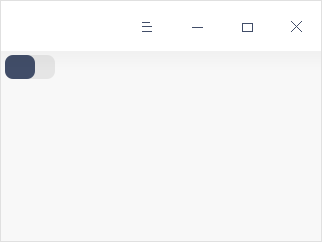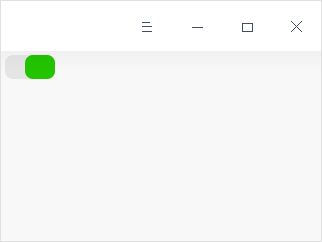


### DTabBar

使用DTabBar 控件可以通过定义与每个选项卡关联的标签和数据来创建选项卡，具体示例代码如下。

```c++
//添加头文件
#include <DTabBar>
#include <DWidget>

DMainWindow w;
DWidget *widget = new DWidget();
DTabBar *tabBar = new DTabBar(widget);
tabBar->addTab("tab1");
tabBar->addTab("tab2");
tabBar->addTab("tab3");
tabBar->setAutoHide(true);
tabBar->setExpanding(false);
tabBar->setEnabledEmbedStyle(true);
tabBar->setFixedWidth(550);
w.setCentralWidget(widget);
w.show();
```

setEnabledEmbedStyle方法可以设置两种风格，如下图所示一种是圆角，另一种是直角。DTabBar控件效果图1

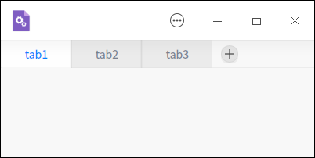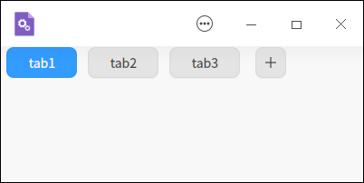


### DButtonBox 

按钮盒(DButtonBox)可以很方便地快速布置一组标准按钮，具体示例代码如下。

```c++
//添加头文件
#include <DButtonBox>
#include <DMainWindow>
#include <DGuiApplicationHelper>
#include <DWidget>

DMainWindow w;
DWidget *widget = new DWidget;
    DButtonBox *buttonBox = new DButtonBox;
    buttonBox->setButtonList({new DButtonBoxButton("tab1"), new DButtonBoxButton("tab2")}, true);
    buttonBox->setId(buttonBox->buttonList().at(0), 0);
    buttonBox->setId(buttonBox->buttonList().at(1), 1);
    if (DGuiApplicationHelper::instance()->themeType() == DGuiApplicationHelper::LightType) {
        buttonBox->buttonList().at(0)->click();
    } else {
        buttonBox->buttonList().at(1)->click();
    }
    w.titlebar()->addWidget(buttonBox);
w.setCentralWidget(widget);
w.show();
```

具体效果如下图所示。

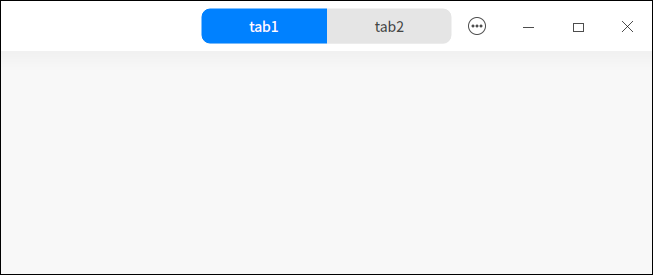


### DIconButton

图标按钮组件（DIconButton）是可以响应按下事件，并且按下时会带一个水波纹的效果，具体示例代码如下。

```c++
//添加头文件
#include <DIconButton>
#include <DWidget>

DMainWindow w;
DWidget *widget = new DWidget();
DIconButton button(widget);
QIcon icon(QIcon::fromTheme("preferences-system"));
button.setIcon(icon);
//设置图片为圆角
//button.setEnabledCircle(true);
QObject::connect(&button, &DIconButton::clicked, []{
    qInfo() << "clicked.";
});
button.setIconSize(QSize(128, 128));
w.setCentralWidget(widget);
w.show();
```

DIconButton 提供了一个默认为圆角矩形可设置图片的 button，比如窗口的最大最小化以及关闭按钮、DTabBar 的 +/- 按钮等。只有图片没有文字的按钮适合用 DIconButton，有固定的背景色。setEnabledCircle 可以将其设置为圆形的边框。

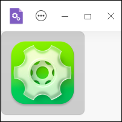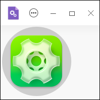


### DToolButton

DToolButton 继承自 QToolButton 并进行了重绘，可提供对特定命令或选项的快速访问，与普通命令按钮不同，工具按钮通常不显示文本标签，而是显示图标。具体示例代码如下。

```c++
//添加头文件
#include <DToolButton>
#include <DWidget>

DMainWindow w;
DWidget *widget = new DWidget();
DToolButton button(widget);
button.setIcon(QIcon::fromTheme("printer_lrtb_1"));
QObject::connect(&button, &DToolButton::clicked, []{
    qInfo() << "clicked.";
});
w.setCentralWidget(widget);
w.show();
```

效果如下图所示。

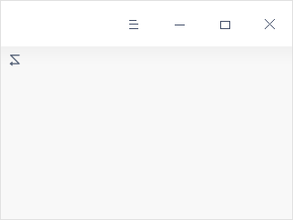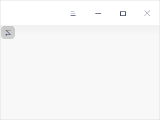


### DFloatingButton

DFloatingButton 继承自 DIconButton，将其重绘成圆形并增加了背景色，背景色默认跟随系统（例如在控制中心，选择个性化，选择通用，选择活动用色中设置的颜色），具体示例代码如下。

```c++
//添加头文件
#include <DFloatingButton>
#include <DWidget>

DMainWindow w;
DWidget *widget = new DWidget();
DFloatingButton button(widget);
QIcon icon(QIcon::fromTheme("preferences-system"));
button.setIcon(icon);
//button.setBackgroundRole(QPalette::Button);
QObject::connect(&button, &DFloatingButton::clicked, []{
    qInfo() << "clicked.";
});
w.setCentralWidget(widget);
w.show();
```

如锁屏界面的解锁按钮、控制中心的增加账户按钮等。如下图所示按钮展示的绿色就是因为当前系统的活动色是绿色。

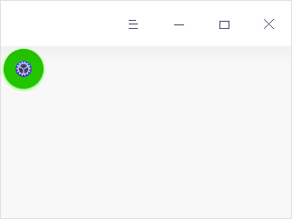

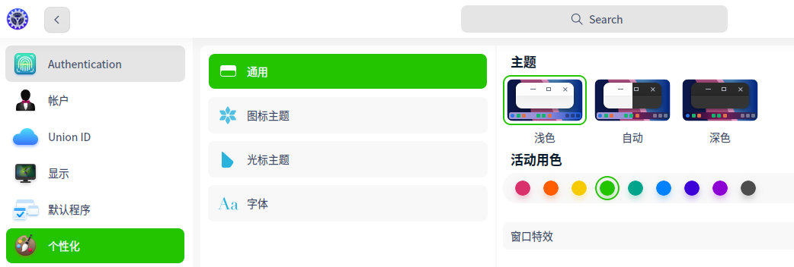


### DSuggestButton

DSuggestButton 通常和 DPushButton 一起用，引导用户点击，在 DDiaLog 里面也有用到DSuggestButton按钮。具体示例代码如下。

```c++
//添加头文件
#include <DPushButton>
#include <DSuggestButton>
#include <DWidget>

DMainWindow w;
DWidget *widget = new DWidget;
QHBoxLayout *layout = new QHBoxLayout(widget);
DPushButton button1("取消", widget);
DSuggestButton button2("同意", widget);
button1.setCheckable(false);
layout->addWidget(&button1);
layout->addWidget(&button2);
QObject::connect(&button1, &DSuggestButton::clicked, []{
    qInfo() << "button1 clicked.";
});
QObject::connect(&button2, &DSuggestButton::clicked, []{
    qInfo() << "button2 clicked.";
});
w.setCentralWidget(widget);
w.show();
```

具体效果如下图所示。

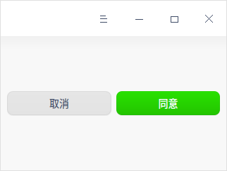


### DWarningButton

DWarningButton功能和普通的文字按钮一致，不过用在警告语上，告诉用户有危险操作。如在控制中心，选择账户，选择删除账户的按钮。具体示例代码如下。

```c++
//添加头文件
#include <DWarningButton>
#include <DWidget>

DMainWindow w;
DWidget *widget = new DWidget();
DWarningButton button(widget);
button.setText("移除");
QObject::connect(&button, &DWarningButton::clicked, []{
    qInfo() << "clicked.";
});
w.setCentralWidget(widget);
w.show();
```

具体效果如下图所示。

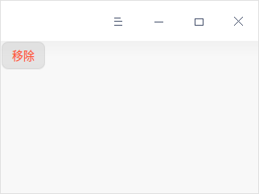


### DSpinBox

DSpinBox用于从一些固定的值中选取一个，具体示例代码如下。

```c++
//添加头文件
#include <QVBoxLayout>
#include <DDoubleSpinBox>
#include <DWidget>

DMainWindow w;
DWidget *widget = new DWidget();
QVBoxLayout *bgwLayout = new QVBoxLayout(widget);
DSpinBox box1;
DDoubleSpinBox box2;
bgwLayout->addWidget(&box1);
bgwLayout->addWidget(&box2);
w.setCentralWidget(widget);
w.show();
```

DTK 继承并重绘了 Qt 的两种 spinbox，如下图所示。

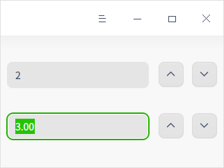


### DCommandLinkButton

DCommandLinkButton 模拟链接跳转，鼠标放上去会有高亮提示，可以在点击按钮之后执行一些自定义的命令操作，比如在打开网址，打开其它应用等场景下使用。具体示例代码如下。

```c++
//添加头文件
#include <DCommandLinkButton>
#include <QProcess>
#include <DWidget>

DMainWindow w;
DWidget *widget = new DWidget();
DCommandLinkButton *linkButton = new DCommandLinkButton("点击访问UOS官网", widget);
    QObject::connect(linkButton, &DCommandLinkButton::clicked, [&w, widget] {
        QProcess::startDetached("xdg-open https://www.chinauos.com/");
    });
w.setCentralWidget(widget);
w.show();
```

具体效果如下图所示。

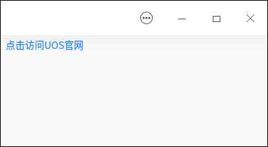
