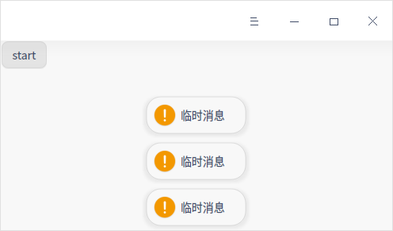
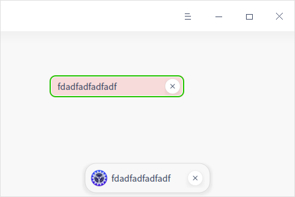
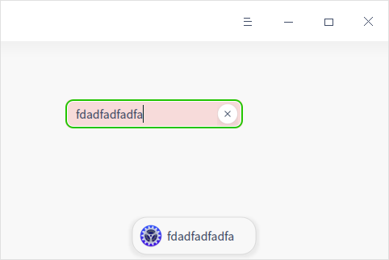
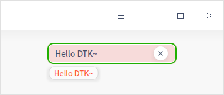
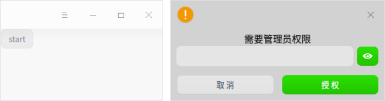
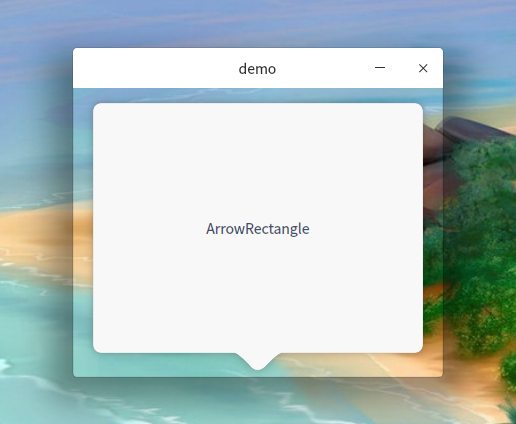

## 消息通知与提示

在使用计算机的时候，通常都会有一些应用程序的通知消息，这时候需要用到消息通知与提示。

### DMessageManager

使用 DMessageManager 可以非常方便地创建多语种应用消息，MainWindow 自己也给自己可以发送消息，具体示例代码如下：

```c++
  #include <DWidget>
  #include <DMainWindow>

  DMainWindow w;
  Dtk::Widget::moveToCenter(&w);
  DWidget *widget = new DWidget;
  w.setCentralWidget(widget);
  w.sendMessage(widget->style()->standardIcon(QStyle::SP_MessageBoxWarning), "临时消息");
```

以上是创建了一个 widget 托管给 MainWindow ，在上面显示一些临时消息，几秒钟后灰自动消失。

另外，还可以通过 DMessageManager 给 widget 发消息，具体示例代码如下，具体效果如下图所示。

```c++
  #include<DPushButton>
  #include <DMainWindow>
  #include <DWidget>
  #include<DMessageManager>

  DMainWindow w;
  Dtk::Widget::moveToCenter(&w);
  DWidget *widget = new DWidget;
  w.setCentralWidget(widget);
  DPushButton *button = new DPushButton("start", widget);
  QObject::connect(button, &DPushButton::clicked, [ = ] {
  DMessageManager::instance()->sendMessage(widget, widget->style()->standardIcon(QStyle::SP_MessageBoxWarning), "临时消息");
  });
```

​		点击按钮，发送的够快的话，最多可以堆叠显示三条消息，4秒后会自动消失。



还可以使用 DMessageManager 配合 DFloatingMessage 发送常驻消息，需要手动点击按钮才会消失：

```c++
  #include <DMainWindow>
  #include <DWidget>
  #include <DLineEdit>
  #include <DMessageManager>
  #include <DFloatingMessage>

  DMainWindow w;
  Dtk::Widget::moveToCenter(&w);
  DWidget *widget = new DWidget;
  w.setCentralWidget(widget);

  // 创建一个 lineedit
  DLineEdit *pNormalLineEdit = new DLineEdit(widget);
  pNormalLineEdit->setEchoMode(QLineEdit::Normal);
  pNormalLineEdit->resize(220, 40);

  // 创建消息
  DMessageManager *manager = DMessageManager::instance();
  DFloatingMessage *msg = new DFloatingMessage(DFloatingMessage::ResidentType);

  // 设置图标
  msg->setIcon(QIcon(QIcon::fromTheme("preferences-system")));

  // 在编辑 lineedit 输入的时候发送消息，消息内容是 lineedit 里面输入的内容
  QObject::connect(pNormalLineEdit, &DLineEdit::textChanged, &w, [&](const QString &text) {
  msg->setMessage(text);
  manager->sendMessage(widget, msg);
  });
```

以上，输入内容的时候创建一个 msg，通过 manager 发送给  widget ，显示在界面下方的中间位置。
sendMessage 的时候，msg 将被发送到 widget ，同时内部也将 msg 托管给 widget ，所以不用手动释放给 msg 分配的内存。具体示例代码如上所示，具体效果下图所示。
DFloatingMessage::ResidentType 是常驻消息，DFloatingMessage::TransientType 是临时消息，默认构造是创建临时消息。临时消息没有关闭按钮，不主动关闭 4s 后消失。



常驻消息有一个关闭按钮，不主动关闭就不会消失，如下图所示。



### DAlertMessage
DAlertMessage 类提供了一种显示输入提示消息、应用内通知消息的方式。可以设置永久显示，默认是隔几秒钟后就会消失。具体示例代码如下，具体效果如下图所示。

```c++
  #include <DMainWindow>
  #include <DLineEdit>
  #include <DAlertControl>

  DMainWindow w;
  w.resize(380, 160);
  DLineEdit *pNormalLineEdit = new DLineEdit(&w);
  pNormalLineEdit->setEchoMode(QLineEdit::Normal);

  // 设置警告色
  pNormalLineEdit->setAlert(true);
  pNormalLineEdit->move(80,70);
  pNormalLineEdit->resize(220,40);

  // 可以直接使用 pNormalLineEdit->showAlertMessage，也可以使用 DAlertControl 控制对齐方式
  DAlertControl *ctrl = new DAlertControl(pNormalLineEdit, &w);
  ctrl->setMessageAlignment(Qt::AlignLeft);
  QObject::connect(pNormalLineEdit, &DLineEdit::textChanged, &w, [&](){
   ctrl->showAlertMessage(pNormalLineEdit->text());
  });
  w.show();
```

效果如下图所示：



### DDiaLog
DDiaLog 提供了类似于 Windows 上的消息弹框的机制，让用户确认一些选项，具体示例代码如下，具体效果如下图所示，其中左侧是按钮，右侧是具体效果。

```c++
#include <QObject>
#include <DWidget>
#include <DMainWindow>
#include <DDialog>
#include <DPushButton>

	DWidget *widget = new DWidget;
 	DMainWindow w;
	w.setCentralWidget(widget);
	QPushButton *button = new QPushButton("start", widget);
	QObject::connect(button, &DPushButton::clicked, [ = ] {
  	DDialog dialog;
  	dialog.setIcon(widget->style()->standardIcon(QStyle::SP_MessageBoxWarning));
  	dialog.setTitle("需要管理员权限");
  	dialog.addContent(new DPasswordEdit);
  	dialog.addButton("取消");
  	dialog.addButton("授权", false, DDialog::ButtonRecommend);
  	dialog.exec();
});
```



### DArrowRectangle

该组件提供了一个消息对话框的样式，可以设置尖头的方向，有 FloatWidget 模式和 FloatWindow 模式，FloatWidget 模式可以嵌入到其它窗口显示，FloatWindow 模式可以单独显示在固定的位置。最常见的应用就是在任务栏的预览页面，显示已打开应用窗口的缩略图，如图所示分别是 FloatWindow 模式和 FloatWidget 模式。具体示例代码如下。

```c++
  #include <DMainWindow>
  #include <DArrowRectangle>
  #include <QLabel>

  DArrowRectangle *arrowRect = new DArrowRectangle(DArrowRectangle::ArrowBottom, DArrowRectangle::FloatWindow);
  // DArrowRectangle *arrowRect = new DArrowRectangle(DArrowRectangle::ArrowBottom, DArrowRectangle::FloatWidget);
  arrowRect->setRadius(8);
  arrowRect->setRadiusArrowStyleEnable(true);
  QLabel *content = new QLabel("ArrowRectangle");
  content->setAlignment(Qt::AlignCenter);
  content->resize(320,240);
  arrowRect->setContent(content);
  arrowRect->show(320, 240);
```



