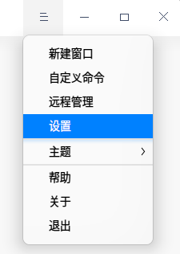
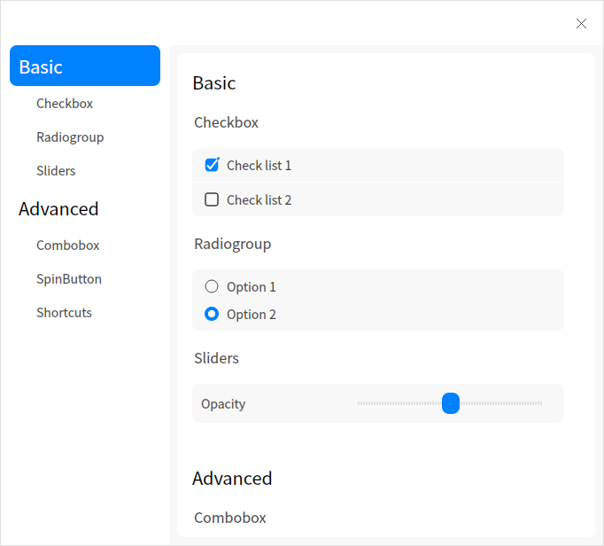
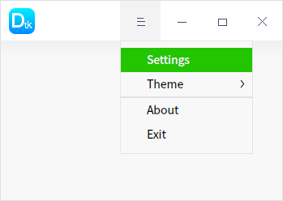
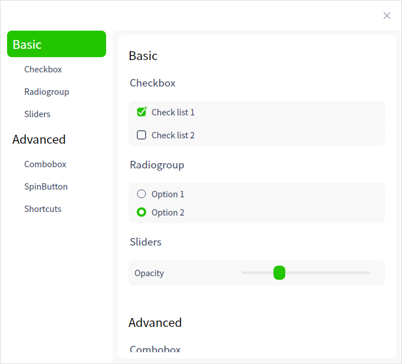
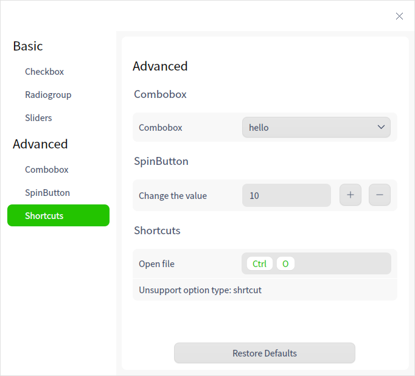

## DTK 中的设置界面框架

在所有统信 UOS 系统的应用中，窗口标题栏都提供了程序选项按钮，单击这类按钮会弹出一个菜单，并且包含一个设置菜单项，用户单击设置菜单项就能打开程序的设置窗口。
这是所有 DTK 风格应用程序需要遵循的设计风格。本小节会就此内容进行说明，并通过修改 DTK-example 程序演示如何给应用添加设置窗口，以保证应用跟其他 DTK 应用风格保持一致。

### 简介

应用程序的设置菜单，具有统一的入口，可以使用 Json 文件进行配置生成一个设置对话框，如下图所示。



### 示例

```c++
//添加头文件
#include <qsettingbackend.h>
#include <DStandardPaths>
#include <DTitlebar>
#include <DSettingsDialog>
#include <DWidget>
DWIDGET_USE_NAMESPACE

DMainWindow w;
DWidget *widget = new DWidget;
DTitlebar *titlebar = w.titlebar();
titlebar->setIcon(QIcon(":/menu/logo_icon.svg"));
if (titlebar) {
    titlebar->setMenu(new QMenu(titlebar));
    titlebar->setSeparatorVisible(true);
    titlebar->menu()->addAction("menu-settings");
}
auto initJsonFile = []
{
    // 构造配置文件路径
    const QString confDir = DStandardPaths::writableLocation(QStandardPaths::AppConfigLocation);
    const QString confPath = confDir + QDir::separator() + "DTK-example.conf";
    // 创建设置项存储后端
    QSettingBackend *backend = new QSettingBackend(confPath);
    // 通过json文件创建DSettings对象
    DSettings *settings = DSettings::fromJsonFile(":/menu/DTK-settings.json");
    // 设置DSettings存储后端
    settings->setBackend(backend);

    return settings;
};
DSettingsDialog *settingsDialog = nullptr;
auto createSettingsMenu = [&settingsDialog, widget]
{
    // 创建 QMenu
    QMenu *menu = new QMenu;
    // 创建设置界面并在点击的时候显示
    settingsDialog = new DSettingsDialog(widget);
    QAction *settingsAction = menu->addAction("Settings");
    QObject::connect(settingsAction, &QAction::triggered, [&] {
        settingsDialog->show();
    });
    return menu;
};
// 给标题栏添加设置菜单
QMenu *settingsMenu = createSettingsMenu();
// 通过DSettings对象构建设置界面
DSettings *settings = initJsonFile();
// 更新 Json 数据到 dialog
settingsDialog->updateSettings(settings);
QObject::connect(settings, &DSettings::valueChanged, [](const QString &key, const QVariant &value) {
    // 这里处理设置后的值
    qInfo() << "value changed: " << key << "  " << value;
});
// 将创建的菜单按钮添加到 titlebar
w.titlebar()->setMenu(settingsMenu);
w.setCentralWidget(widget);
w.show();
```

以上代码包含初始化、函数定义的部分，同时在标题栏的程序选项菜单中添加了设置菜单项，通过将 json 文件内容解析、设置到页面中。为了方便应用开发者构建设置窗口界面，DTK 开发了一套通过 json 文件创建设置界面的机制。在构建设置窗口界面的时候，应用开发者无须再一行代码一行代码构建界面，而是通过一个 json 文件描述设置界面内容，经过 DSettings 加载，传递给 DSettingsDialog 构建界面即可。效果如下图所示：



### 详解

在上面的代码中，新建了一个类 settingsDialog，用于该程序的应用设置界面。其中，DSettings 需要一个存储后端来存放设置数据，DTK 提供了两个可选选项，一个是上面例子中用到的 QSettingsBackend，另外一个是 GSettingsBackend。从名字上可以看出，QSettingsBackend 使用 QSettings 作为存储后端，而 GSettingsBackend 使用 GSettings 作为存储后端。GSettings 相较于 QSettings，优点在于可以有系统和用户级两套配置，在系统定制时比较方便，而且其本身有一套通知机制；但是，缺点也比较明显，就是它在使用上比较麻烦。本例为了方便，演示时使用QSettings作为存储后端。
存储后端构建完成后，通过 DSettings::setBackend 设置给 DSettings 对象，DSettingsDialog 则通过 DSettingsDialog::updateSettings 方法加载 DSettings 的内容。 DSettings从json文件加载内容时，则是使用 DSettings::fromJsonFile 方法，在本例中 DTK-settings.json文 件的内容如下：

```json
{
    "groups": [
        {
            "key": "basic",
            "name": "Basic",
            "groups": [
                {
                    "key": "select_multiple",
                    "name": "Checkbox",
                    "options": [
                        {
                            "key": "checkbox_1",
                            "text": "Check list 1",
                            "type": "checkbox",
                            "default": 1
                        },
                        {
                            "key": "checkbox_2",
                            "text": "Check list 2",
                            "type": "checkbox"
                        }
                    ]
                },
                {
                    "key": "select_single",
                    "name": "Radiogroup",
                    "options": [
                        {
                            "key": "radiogroup",
                            "name": "",
                            "type": "radiogroup",
                            "items": [
                                "Option 1",
                                "Option 2"
                            ],
                            "default": 1
                        }
                    ]
                },
                {
                    "key": "slider",
                    "name": "Sliders",
                    "options": [
                        {
                            "key": "slider",
                            "type": "slider",
                            "name": "Opacity",
                            "min": 0,
                            "max": 100,
                            "default": 50
                        }

                    ]
                }
            ]
        },
        {
            "key": "advanced",
            "name": "Advanced",
            "groups": [
                {
                    "key": "combo",
                    "name": "Combobox",
                    "options": [
                        {
                            "key": "combobox",
                            "name": "Combobox",
                            "type": "combobox",
                            "items": [
                                "hello", "world"
                            ],
                            "default": "hello"
                        }
                    ]
                },
                {
                    "key": "spin",
                    "name": "SpinButton",
                    "options": [
                        {
                            "key": "spin",
                            "name": "Change the value",
                            "type": "spinbutton",
                            "default": 10
                        }
                    ]
                },
                {
                    "key": "shortcuts",
                    "name": "Shortcuts",
                    "options": [
                        {
                            "key": "open_file",
                            "name": "Open file",
                            "type": "shortcut",
                            "default": "Ctrl+o"
                        },
                        {
                            "key": "open_folder",
                            "name": "Open folder",
                            "type": "shrtcut",
                            "default": "Ctrl+f"
                        }
                    ]
                }

            ]
        }

    ]
}
```

如下图所示展示了添加进去的 icon 和菜单按钮。



打开 Settings 菜单，页面内容如下图所示。



其中 Shortcuts 内容如下图所示。



由 DSettings 生成的设置对话框分为左右两个部分，左侧是导航栏，右侧为设置内容，在设置内容最下方是重置按钮，用户可以通过这个按钮将程序所有的设置项重置。
json 文件最外层是一个无名对象，包含属性 groups，这是一级导航，例如图中的 Basic；一级导航下层是二级导航，例如图中的 Checkbox，二级导航在 json 文件中以一个对象的形式出现，包含属性 key、name 和 options。其中，key 为字符串，表示设置项目的唯一 ID，json 文件中除最顶层的对象外其余的对象均需设置 key 属性；name 属性同样为字符串，表示标题的名称；options 属性为数组，包含当前二级标题下的所有设置项。每个设置项都从属于一个特定的二级导航，每个二级导航都从属于一个一级导航。
每个设置项可以对应于不同的控件类型，在设置项的 json 对象中使用 type 属性来标识，DSettings 目前支持的 type 属性类型和其对应生成的控件关系如下表所示。

| type字段     | 生成控件                         | json属性       |
| ------------ | -------------------------------- | -------------- |
| checkbox     | QCheckBox                        | text           |
| radiogroup   | QRadioButton 组成的 QButtonGroup | items          |
| slider       | QSlider                          | name、min、max |
| combobox     | QComboBox                        | name、items    |
| spinbutton   | QSpinBox                         | name、min、max |
| shortcut     | ShortcutEdit                     | name           |
| lineedit     | QLineEdit                        | name、text     |
| buttongroup  | DButtonBox                       | name、items    |
| switchbutton | DSwitchButton                    | name           |
| title1       | QWidget 和 QLable 组成的标题     | text           |
| title2       | QWidget 和 QLable 组成的标题     | text           |

除了上面列出的属性外，每个控件可选提供一个 default 属性，表示设置项默认值，用于重置按钮单击后的设置重置处理，建议所有控件都设置一个默认值。

 