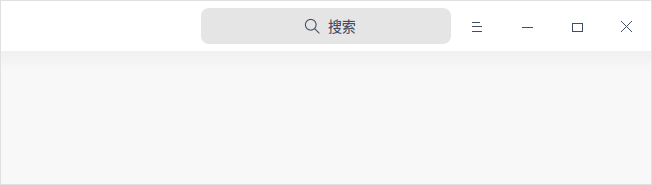
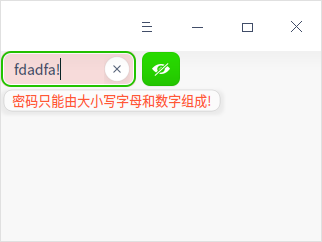
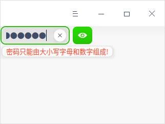
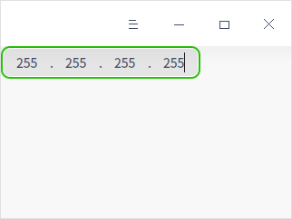
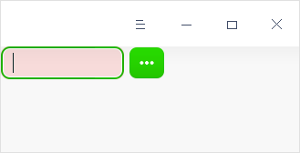
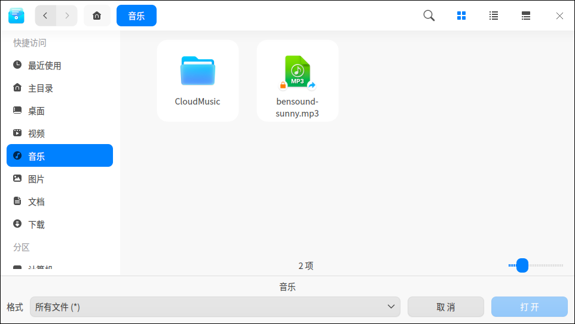
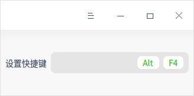
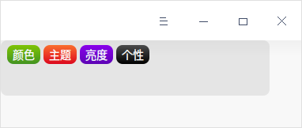

## 输入和编辑框

编辑框是一种很常用的控件，可以在编辑框中输入并编辑文本。

### DSearchEdit

```c++
//添加头文件
#include <DSearchEdit>

DMainWindow w;
DSearchEdit *search = new DSearchEdit;
search->setPlaceHolder("搜索");
w.titlebar()->addWidget(search);
w.titlebar()->setIcon(QIcon());
w.show();
```

DSearchEdit 用于用户的搜索查询功能，具体示例代码如上，运行效果如下图所示。以上是将 DSearchEdit 添加到标题栏里面，也可以自己设置应用的图标到标题栏。搜索逻辑涉及到业务内容，是比较复杂的一块，具体可以参考 dde-control-center 的实现。




### DPasswordEdit

DPasswordEdit 提供了一个安全的密码输入框，支持明文、密文的输入模式，继承自 DLineEdit，支持右键菜单。

```c++
//添加头文件
#include <DPasswordEdit>
#include <DAlertControl>
#include <DWidget>

DMainWindow w;
DWidget *widget = new DWidget();
DPasswordEdit *edit = new DPasswordEdit(widget);
DAlertControl *ctrl = new DAlertControl(edit, &w);
ctrl->setMessageAlignment(Qt::AlignLeft);
QObject::connect(edit, &DPasswordEdit::textEdited, [edit, ctrl] (QString text) {
    if (text.length() < 8) {
        edit->setAlert(true);
    } else {
        edit->setAlert(false);
    }
    if(!text.contains(QRegExp("^[a-zA-Z0-9]+$"))){
        ctrl->showAlertMessage("密码只能由大小写字母和数字组成!");
    }
});
w.setCentralWidget(widget);
w.show();
```

上面的示例代码创建了一个密码输入框，可以很方便的显示明文、密文，使用 setAlert 来显示警告色，当密码长度不够 8 位的时候显示警告，并且使用正则表达式验证密码是否符合规范，具体效果如下图所示。继承于 DLineEdit 的都可以设置警告色，并支持右键菜单。




### DIpv4LineEdit

DPasswordEdit 提供了一个 ipv4 的输入框，可以严格保证输入内容的正确性，具体示例代码如下，运行效果如下图所示。

```c++
//添加头文件
#include <DIpv4LineEdit>
#include <DWidget>

DMainWindow w;
DWidget *widget = new DWidget();
DIpv4LineEdit edit(widget);
w.setCentralWidget(widget);
w.show();
```




### DFileChooserEdit

```c++
//添加头文件
#include <DFileChooserEdit>
#include <DWidget>

DMainWindow w;
DWidget *widget = new DWidget();
DFileChooserEdit fileChooserEdit(widget);
fileChooserEdit.setSizePolicy(QSizePolicy::Expanding, QSizePolicy::Preferred);
fileChooserEdit.setAlert(true);
w.setCentralWidget(widget);
w.show();
```

DFileChooserEdit 提供了一个选择获取文件路径的基本组件，会自动创建 Dialog 以选择文件，具体示例代码如下，运行效果如下图所示。




### DKeySequenceEdit

DKeySequenceEdit用作对快捷键的采集。具体示例代码如下，运行效果如下图所示。

```c++
//添加头文件
#include <DKeySequenceEdit>
#include <DWidget>

DMainWindow w;
DWidget *widget = new DWidget();
QHBoxLayout *bgwLayout = new QHBoxLayout(widget);
QLabel *setSeqLabel = new QLabel("设置快捷键", widget);
setSeqLabel->setFixedSize(72, 19);
setSeqLabel->setAlignment(Qt::AlignLeft);
DKeySequenceEdit *ksEdit = new DKeySequenceEdit(widget);
ksEdit->setKeySequence(QKeySequence(Qt::ALT + Qt::Key_F4));
bgwLayout->addWidget(setSeqLabel);
bgwLayout->addWidget(ksEdit);
w.setCentralWidget(widget);
w.show();
```




### DCrumbEdit

DCrumbEdit 提供了一个编辑框，编辑框内可包含若干个标签，并允许通过用户输入来编辑这些标签。编辑框所包含的标签可通过标签的文字内容确定唯一的标签，即编辑框所包含的标签内容（字符串值）均不重复。具体示例代码如下，运行效果如下图所示。

```c++
//添加头文件
#include <DCrumbEdit>

DMainWindow w;
w.resize(380, 160);
DCrumbEdit *edit = new DCrumbEdit(&w);
edit->setFixedSize(340, 70);
DCrumbTextFormat first = edit->makeTextFormat();
first.setText("颜色");
DCrumbTextFormat second = edit->makeTextFormat();
second.setText("主题");
DCrumbTextFormat third = edit->makeTextFormat();
third.setText("亮度");
DCrumbTextFormat forth = edit->makeTextFormat();
forth.setText("个性");
edit->insertCrumb(first);
edit->insertCrumb(second);
edit->insertCrumb(third);
edit->insertCrumb(forth);
w.setCentralWidget(edit);
w.show();
```



为实现输入框在表现形式以及行为上的一些特殊需求，DTK引入了自己的输入控件：DLineEdit、DSearchEdit、DPasswordEdit和DIpv4Edit。DLineEdit 在 QLineEdit的基础上加入了警告，即可以通过 setAlert 方法设置 DLineEdit 的警告状态，并且通过 showAlertMessage 显示警告信息。