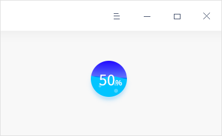
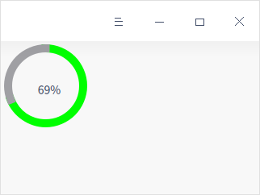
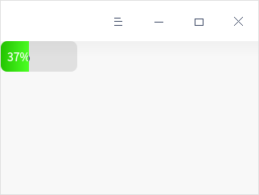
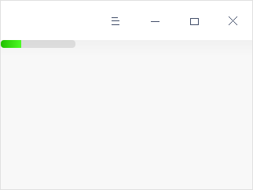
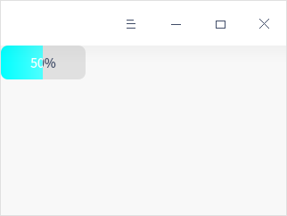
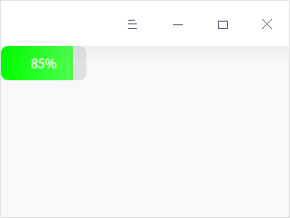
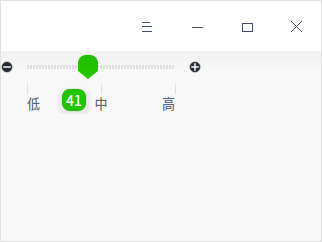

## 进度、状态指示

### DWaterProgress

​		DTK 全新实现了一个水波纹的进度条，重绘了 Qt 的进度条，封装了更好用的带颜色指示的进度条。下面的代码给出水波纹进度指示示例代码，具体效果如图所示

```c++
//添加头文件
#include <DWaterProgress>
#include <DWidget>

DWidget *widget = new DWidget;
DWaterProgress progress(widget);
progress.setValue(50);
progress.start();
progress.setFixedSize(60,60);
```




### DCircleProgress

​		下面的代码给出环形进度指示示例，具体效果如图所示。

```c++
//添加头文件
#include <dcircleprogress.h>
#include <DWidget>
#include <QTimer>

DWidget *widget = new DWidget;
DCircleProgress *progress = new DCircleProgress(widget);
progress->resize(120,120);
progress->setLineWidth(10);

// 设置总量环形颜色为灰色
progress->setBackgroundColor(Qt::gray);
// 设置当前进度部分颜色为浅蓝色
progress->setChunkColor(QColor(Qt::green));

QTimer *timer = new QTimer(widget);
QObject::connect(timer, &QTimer::timeout, [&progress](){
    static int i = 0;
    i++;
    i = i%101;
    progress->setValue(i);
    progress->setText(QString("%1%").arg(i));
});
timer->setInterval(100);
timer->start();
```

​		DWaterProgress为动态显示的控件，在调用了DWaterProgress::start方法以后控件即开始水纹波动的动画，DCircleProgress则具有一定的样式定制性，总量环形和当前进度的部分可以分别设置颜色。




### DProgressBar

```c++
//添加头文件
#include <DProgressBar>
#include <DWidget>

DWidget *widget = new DWidget;
auto pNoTextBar = new DProgressBar(widget);
// pNoTextBar->setFixedHeight(10);
static auto pBarRun = [](QWidget *pBar){
    auto animation = new QPropertyAnimation(pBar, "value");
    animation->setDuration(10000);
    animation->setLoopCount(-1);
    animation->setStartValue(0);
    animation->setEndValue(100);
    animation->start();
};
pBarRun(pNoTextBar);
```

​		上面的代码给出了进度显示示例，给一个进度条添加一个动画去运行并显示文字，如图左1所示。如果进度条不想显示文字，将其设置的窄一些就可以了，如图右1所示。




### DColoredProgressBar

```c++
//添加头文件
#include <DWidget>
#include <DColoredProgressBar>
#include <QTimer>

DWidget *widget = new DWidget;
w.setCentralWidget(widget);
DColoredProgressBar *clrPBar = new DColoredProgressBar(widget);
clrPBar->setAlignment(Qt::AlignHCenter | Qt::AlignVCenter);

//定义进度条的颜色
clrPBar->addThreshold(10, QBrush(QColor(Qt::black)));
clrPBar->addThreshold(20, QBrush(QColor(Qt::red)));
clrPBar->addThreshold(30, QBrush(QColor(Qt::green)));
clrPBar->addThreshold(40, QBrush(QColor(Qt::blue)));
clrPBar->addThreshold(50, QBrush(QColor(Qt::cyan)));
clrPBar->addThreshold(60, QBrush(QColor(Qt::darkGray)));
clrPBar->addThreshold(70, QBrush(QColor(Qt::black)));
clrPBar->addThreshold(80, QBrush(QColor(Qt::green)));
clrPBar->addThreshold(90, QBrush(QColor(Qt::magenta)));
QTimer *timer = new QTimer(widget);
QObject::connect(timer, &QTimer::timeout, [clrPBar](){
    static int i = 0;
    i++;
    i = i%101;
    clrPBar->setValue(i);
});
timer->setInterval(100);
timer->start();
```

​		上面的代码给出了带颜色的进度条显示示例，创建了一个带颜色的进度条显示，使用定时器去更新进度，如图左1所示：，达到设定的进度值之后显示自定义颜色，如图右1所示：




### DSlider

​		DSlider控件可以滑块，选择需要的值，下面是具体示例代码。

```c++
//添加头文件
#include <DSlider>
#include <DWidget>

DWidget *widget = new DWidget;
DSlider slider;
slider.setParent(widget);
slider.setLeftIcon(QIcon::fromTheme("emblem-remove"));
slider.setRightIcon(QIcon::fromTheme("emblem-added"));
slider.setMouseWheelEnabled(true);
slider.setMinimumWidth(200);
slider.setMinimum(0);
slider.setMaximum(100);
QObject::connect(&slider, &DSlider::valueChanged, [&slider](int value){
    slider.setTipValue((std::to_string(value)).c_str());
});
// slider.setMarkPositions({0, 10, 20, 30, 40, 50, 60, 70, 80, 90, 100});
slider.setBelowTicks({"低", "中", "高"});
```

​		DSlider 将 QSlider 进行了重绘，添加了气泡提示、左右侧图标、刻度等，具体效果如下图所示。




### DSpinner

​		下面是DSpinner的示例代码。

```c++
//添加头文件
#include <DSpinner>
#include <DWidget>

DWidget *widget = new DWidget;
DSpinner *spiner = new DSpinner(widget);
spiner->start();
```

​		该组件提供了一个动态的指示图标，在界面加载、任务阻塞的时候使用，如下图所示：


